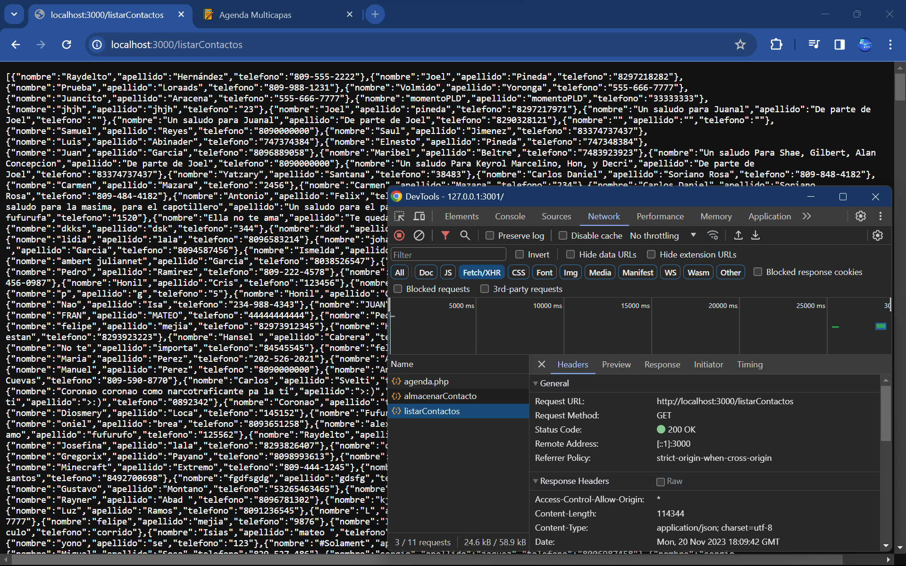

# Servicio Web

Esta es la tarea #5 de Emmanuel Soto, esta es la captura de pantalla:

> Servicio Web realizado con la librería Express de nodeJS.

## Tarea #5 </> Servicio Web:

Haga un Servicio Web utilizando la librería Express de nodeJS que haga las dos operaciones básicas de listar y almacenar contactos realizados por el servicio http://www.raydelto.org/agenda.php el cual usted ha utilizado en las dos tareas anteriores. 